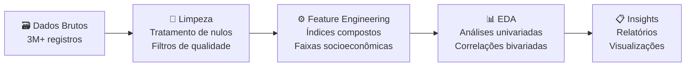

# 📊 Análise ENEM 2023: Desvendando Desigualdades Educacionais no Brasil com Python e Estatística

## Algumas visões geradas no projeto:


* Caso queira ver a galeria de graficos e figuras, acesse (https://github.com/Thiago-Folgado/enem/tree/main/reports/figures)

<div align="center">


*Uma análise exploratória completa dos microdados do ENEM 2023, revelando padrões socioeconômicos que influenciam o desempenho educacional brasileiro.*

</div>

## 🎯 **Sobre o Projeto**

Este projeto realiza uma análise exploratória completa dos **microdados do ENEM 2023**, processando mais de **3 milhões de registros** para identificar padrões e correlações entre fatores socioeconômicos, caracteristicas do candidato e desempenho educacional no Brasil.

### **Motivação**
- 🔍 **Identificar** fatores que influenciam o desempenho no ENEM
- 📊 **Quantificar** desigualdades educacionais regionais, socioeconômicas entre outros fatores 
- 💡 **Gerar insights** para políticas públicas educacionais, para o conhecimento geral e para matar minha curiosidade
- 🛠️ **Demonstrar** habilidades em análise de dados com Python e bibliotecas como pandas, numpy, seaborn e matplotlib

## 📈 **Principais Descobertas [ANALISE EM ANDAMENTO]**

### 🏆 **Insights de Alto Impacto**

| 🔍 **Descoberta** | 📊 **Métrica** | 🎯 **Implicação** |
|-------------------|----------------|-------------------|
| **Correlação Tecnologia-Desempenho** | Índice Tecnológico vs Nota: **r = 0.4** | Acesso à tecnologia é preditor moderado de performance |
| **Desigualdade Regional** | Sudeste, Sul, Centro-Oeste, Nordeste e Norte respectivamente seguem o ranking de performace media | regiões que dispõem de uma ambudancia maior de recursos educacionais seria uma hipótese |
| **Impacto Escolaridade dos Pais** | Correlação: **r = 0.39** | Capital cultural familiar influencia diretamente |
| **Perfil Socioeconômico** | Renda per capita vs Desempenho: **r = 0.47** | Condições econômicas afetam oportunidades educacionais |

### 📊 **Distribuição de Desempenho por Região**
- **Sudeste**: 540.85 pontos (média)
- **Sul**: 536.04 pontos  
- **Centro-Oeste**: 520.61 pontos
- **Nordeste**: 502.62 pontos
- **Norte**: 490.12 pontos

> 💡 **Insight Principal**: A diferença de **50,73 pontos** entre Sudeste e Norte representa um indicativo de desigualdade estrutural significativa.

## 🛠️ **Metodologia**

### **Pipeline de Análise**



### **🔧 Técnicas Aplicadas**
- **Limpeza de Dados**: 
    - Remoção colunas de colunas descnecessarias, pouco relevantes ou redundantes; 
    - Renomeção de colunas e reordenação logica das mesmas; 
    - Mapeamento dos dados categoricos de acordo com o dicionario de dados; 
    - Remoção de candidatos que não compareceram em todas as provas; 
    - Remoção de colunas com alto indice de valores ausentes. 
    - Resultado: De um dataframe pouco intuitivo com diversos fatores a serem tratados e ajustados (2,6mm de registros e 48 colunas) para uma dataframe de legivel, mais enxuto e legivel (3,9mm de registros e 58 colunas).
- **Feature Engineering**:
    - Mapeamento das variaveis qualitativas para quantitavivas ordinais para analises posteriores:
    - Criação de colunas como "Região", "Nota media Geral do candidato", "Faixa de renda per capita";
    - Criação de colunas de índices socioeconômicos compostos para analises posteriores.
- **Análise Estatística**:
    - Correlações de Pearson, distribuições, outliers.
    - Realizando analises Univariadas e Bivariadas para entender melhor a distribuição dos candidatos e suas respectivas performaces e analises das variaveis que afetam ou não a performace do candidato.
- **Visualização**:
    - Histogramas, boxplots, heatmaps de correlação

## 📁 **Estrutura do Projeto**

```
projeto-enem-2023/
├── 📊 notebooks/
│   ├── 01_data_cleaning.ipynb           # Limpeza e tratamento dos dados | 
│   ├── 02_feature_engineering.ipynb     # Criação de variáveis derivadas  
│   └── 03_eda_analytics.ipynb           # Análise exploratória completa
├── 📈 data/
│   ├── samples/                         # Amostras para teste (1k registros)
│   └── processed/                       # Dados processados finais
├── 📋 reports/
│   └── figures/                         # Visualizações principais
├── 📖 README.md                         # Este arquivo
└── 📦 requirements.txt                  # Dependências Python
```


## 🧮 **Tecnologias Utilizadas**

### **🐍 Stack Principal**
- **Python **: Linguagem principal
- **Pandas **: Manipulação de dados
- **NumPy **: Computação numérica
- **Matplotlib **: Visualizações básicas
- **Seaborn **: Visualizações estatísticas avançadas
- **Jupyter**: Ambiente de desenvolvimento interativo

## 📊 **Variáveis Criadas (Feature Engineering)**

### **🔢 Índices Compostos Desenvolvidos e mais**

| **Índice** | **Componentes** | **Interpretação** |
|------------|-----------------|-------------------|
| **Tecnológico** | TV, DVD, Internet, Computador, Celular | Acesso a tecnologias modernas |
| **Eletrodomésticos** | Geladeira, Micro-ondas, Lava-roupas, etc | Conforto doméstico |
| **Transporte** | Carros, Motocicletas | Mobilidade familiar |
| **Estrutura Casa** | Banheiros, Quartos, Empregado doméstico | Infraestrutura residencial |
| **Escolaridade Pais** | Soma escolaridade pai + mãe | Capital cultural familiar |
| **Região** | Região do brasil de acordo com o Estado da prova | Variavel Espacial |
| **Faixa de Renda Per Capita** | De acordo com a Renda familiar declarada, foi feito uma estimativa media considerando tambem a quantidade de pessoas na residencia | Fator economico isolando variavel de Pessoas na residencia |

## 📈 **Principais Análises Realizadas**

### **📊 Análises Univariadas**
- Distribuições de todas as variáveis numéricas
- Análise de outliers com boxplots anotados
- Frequências de variáveis categóricas

### **🔗 Análises Bivariadas**  
- **Matriz de Correlação**: 13 variáveis principais
- **Boxplots Estratificados**: Desempenho por grupos socioeconômicos
- **Análise Regional**: Performance por estado/região

### **🎯 Segmentações Específicas**
- Impacto da **escolaridade dos pais**
- Diferenças por **faixa de renda**
- Padrões **regionais** de desempenho

## 💼 **Aplicações Práticas**

### **🏛️ Para Políticas Públicas**
- Identificação de regiões prioritárias para investimento
- Quantificação do impacto de programas de inclusão digital
- Evidências para programas de apoio socioeconômico

### **🎓 Para Instituições Educacionais**
- Perfil socioeconômico como preditor de desempenho
- Estratégias de nivelamento baseadas em dados
- Alocação eficiente de recursos de apoio

### **📊 Para Análise de Dados**
- Pipeline completo de tratamento de dados públicos
- Técnicas de feature engineering em dados categóricos
- Boas práticas em análise exploratória

## 🔍 **Limitações e Próximos Passos**

### **⚠️ Limitações Identificadas**
- Dados representam apenas um ano (2023)
- Variáveis socioeconômicas são auto-declaradas

### **🚀 Melhorias Futuras**
- [ ] **Análise Temporal**: Comparação com anos anteriores (2019-2023)
- [ ] **Dashboard Interativo**: Streamlit/Dash para exploração dinâmica
- [ ] **Clustering**: Segmentação de perfis de estudantes

## 👤 **Sobre o Autor**

**[Thiago Folgado]**  
*Data Analytics | Business Intelligence*

- 💼 2 anos de experiência em BI e Reporting
- 🎯 Especialização em análise exploratória e visualização de dados
- 📊 Projetos com Python, Pandas, e ferramentas de BI

**Contato**: [LinkedIn](https://www.linkedin.com/in/thiagohenriquef/) | [Portfólio](https://thiagofolgado.framer.website/)

---

## 📄 **Licença**

Os dados do ENEM são públicos e disponibilizados pelo INEP.


