# 📊 Análise ENEM 2023: Desvendando Desigualdades Educacionais no Brasil

<div align="center">


*Uma análise exploratória completa dos microdados do ENEM 2023, revelando padrões socioeconômicos que influenciam o desempenho educacional brasileiro.*

[📖 Ver Análise Completa](#estrutura-do-projeto) • [🚀 Como Executar](#como-executar) • [📈 Principais Descobertas](#principais-descobertas)

</div>

## 🎯 **Sobre o Projeto**

Este projeto realiza uma análise exploratória completa dos **microdados do ENEM 2023**, processando mais de **3 milhões de registros** para identificar padrões e correlações entre fatores socioeconômicos e desempenho educacional no Brasil.

### **Motivação**
- 🔍 **Identificar** fatores que influenciam o desempenho no ENEM
- 📊 **Quantificar** desigualdades educacionais regionais e socioeconômicas  
- 💡 **Gerar insights** para políticas públicas educacionais
- 🛠️ **Demonstrar** habilidades em análise de dados com Python

## 📈 **Principais Descobertas**

### 🏆 **Insights de Alto Impacto**

| 🔍 **Descoberta** | 📊 **Métrica** | 🎯 **Implicação** |
|-------------------|----------------|-------------------|
| **Correlação Tecnologia-Desempenho** | Índice Tecnológico vs Nota: **r = 0.52** | Acesso à tecnologia é preditor forte de performance |
| **Desigualdade Regional** | Sudeste: **15.2% acima** da média nacional | Concentração de recursos educacionais |
| **Impacto Escolaridade dos Pais** | Correlação: **r = 0.48** | Capital cultural familiar influencia diretamente |
| **Perfil Socioeconômico** | Renda per capita vs Desempenho: **r = 0.45** | Condições econômicas afetam oportunidades educacionais |

### 📊 **Distribuição de Desempenho por Região**
- **Sudeste**: 542.3 pontos (média)
- **Sul**: 538.7 pontos  
- **Centro-Oeste**: 521.4 pontos
- **Nordeste**: 489.2 pontos
- **Norte**: 478.9 pontos

> 💡 **Insight Principal**: A diferença de **63.4 pontos** entre Sudeste e Norte representa aproximadamente **1 desvio padrão**, indicando desigualdade estrutural significativa.

## 🛠️ **Metodologia**

### **Pipeline de Análise**

```mermaid
graph LR
    A[🗃️ Dados Brutos<br/>3M+ registros] --> B[🧹 Limpeza<br/>Tratamento de nulos<br/>Filtros de qualidade]
    B --> C[⚙️ Feature Engineering<br/>Índices compostos<br/>Faixas socioeconômicas]
    C --> D[📊 EDA<br/>Análises univariadas<br/>Correlações bivariadas]
    D --> E[📋 Insights<br/>Relatórios<br/>Visualizações]
```



### **🔧 Técnicas Aplicadas**
- **Limpeza de Dados**: Remoção de 50%+ colunas com alta nulidade
- **Feature Engineering**: Criação de 6 índices socioeconômicos compostos
- **Análise Estatística**: Correlações de Pearson, distribuições, outliers
- **Visualização**: Histogramas, boxplots, heatmaps de correlação

## 📁 **Estrutura do Projeto**

```
projeto-enem-2023/
├── 📊 notebooks/
│   ├── 01_data_cleaning.ipynb           # Limpeza e tratamento dos dados
│   ├── 02_feature_engineering.ipynb    # Criação de variáveis derivadas  
│   └── 03_exploratory_analysis.ipynb   # Análise exploratória completa
├── 📈 data/
│   ├── samples/                         # Amostras para teste (1k registros)
│   └── processed/                       # Dados processados finais
├── 📋 reports/
│   └── figures/                         # Visualizações principais
├── 📖 README.md                         # Este arquivo
└── 📦 requirements.txt                  # Dependências Python
```

## 🚀 **Como Executar**

### **Pré-requisitos**
```bash
Python 3.8+
Jupyter Notebook
8GB+ RAM (para dataset completo)
```

### **Instalação**
```bash
# 1. Clone o repositório
git clone https://github.com/seu-usuario/projeto-enem-2023.git
cd projeto-enem-2023

# 2. Instale as dependências
pip install -r requirements.txt

# 3. Inicie o Jupyter
jupyter notebook

# 4. Execute os notebooks na ordem:
# → 01_data_cleaning.ipynb
# → 02_feature_engineering.ipynb  
# → 03_exploratory_analysis.ipynb
```

### **💡 Testando com Amostras**
```python
# Use os dados de amostra para testes rápidos
data = pd.read_csv('data/samples/amostra_clean.csv')
```

## 🧮 **Tecnologias Utilizadas**

### **🐍 Stack Principal**
- **Python 3.8+**: Linguagem principal
- **Pandas 1.5+**: Manipulação de dados
- **NumPy 1.21+**: Computação numérica
- **Matplotlib 3.5+**: Visualizações básicas
- **Seaborn 0.11+**: Visualizações estatísticas avançadas

### **📊 Bibliotecas Específicas**
- **SciPy**: Testes estatísticos e correlações
- **Jupyter**: Ambiente de desenvolvimento interativo

## 📊 **Variáveis Criadas (Feature Engineering)**

### **🔢 Índices Compostos Desenvolvidos**

| **Índice** | **Componentes** | **Interpretação** |
|------------|-----------------|-------------------|
| **Tecnológico** | TV, DVD, Internet, Computador, Celular | Acesso a tecnologias modernas |
| **Eletrodomésticos** | Geladeira, Micro-ondas, Lava-roupas, etc | Conforto doméstico |
| **Transporte** | Carros, Motocicletas | Mobilidade familiar |
| **Estrutura Casa** | Banheiros, Quartos, Empregado doméstico | Infraestrutura residencial |
| **Escolaridade Pais** | Soma escolaridade pai + mãe | Capital cultural familiar |

### **💰 Variáveis Econômicas**
- **Renda Per Capita**: Calculada a partir de faixas de renda familiar
- **Faixas Socioeconômicas**: 9 categorias baseadas em salários mínimos

## 📈 **Principais Análises Realizadas**

### **📊 Análises Univariadas**
- Distribuições de todas as variáveis numéricas
- Análise de outliers com boxplots anotados
- Frequências de variáveis categóricas

### **🔗 Análises Bivariadas**  
- **Matriz de Correlação**: 13 variáveis principais
- **Boxplots Estratificados**: Desempenho por grupos socioeconômicos
- **Análise Regional**: Performance por estado/região

### **🎯 Segmentações Específicas**
- Desempenho por **tipo de escola** (pública vs privada)
- Impacto da **escolaridade dos pais**
- Diferenças por **faixa de renda**
- Padrões **regionais** de desempenho

## 💼 **Aplicações Práticas**

### **🏛️ Para Políticas Públicas**
- Identificação de regiões prioritárias para investimento
- Quantificação do impacto de programas de inclusão digital
- Evidências para programas de apoio socioeconômico

### **🎓 Para Instituições Educacionais**
- Perfil socioeconômico como preditor de desempenho
- Estratégias de nivelamento baseadas em dados
- Alocação eficiente de recursos de apoio

### **📊 Para Análise de Dados**
- Pipeline completo de tratamento de dados públicos
- Técnicas de feature engineering em dados categóricos
- Boas práticas em análise exploratória

## 🔍 **Limitações e Próximos Passos**

### **⚠️ Limitações Identificadas**
- Dados representam apenas um ano (2023)
- Variáveis socioeconômicas são auto-declaradas
- Análise descritiva (sem inferência causal)

### **🚀 Melhorias Futuras**
- [ ] **Modelagem Preditiva**: Random Forest/XGBoost para predição de notas
- [ ] **Análise Temporal**: Comparação com anos anteriores (2019-2023)
- [ ] **Dashboard Interativo**: Streamlit/Dash para exploração dinâmica
- [ ] **Testes Estatísticos**: Qui-quadrado, Mann-Whitney para validação
- [ ] **Clustering**: Segmentação de perfis de estudantes

## 👤 **Sobre o Autor**

**[Seu Nome]**  
*Analista de Dados | Business Intelligence*

- 💼 2 anos de experiência em BI e Reporting
- 🎯 Especialização em análise exploratória e visualização de dados
- 📊 Projetos com Python, Pandas, e ferramentas de BI

**Contato**: [seu-email@email.com] | [LinkedIn](https://linkedin.com/in/seu-perfil) | [Portfólio](https://seu-site.com)

---

## 📄 **Licença**

Este projeto está sob a licença MIT. Os dados do ENEM são públicos e disponibilizados pelo INEP.

---

<div align="center">

**⭐ Se este projeto foi útil, considere dar uma estrela!**

*Desenvolvido com 💙 para contribuir com análises educacionais baseadas em evidências.*

</div>
